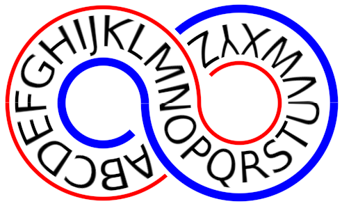

# GIMP-FRASTRUCTURE

This repository contains a miscellaneous collection of python scripts for image processing with the [GNU Image Manipulation Program](https://www.gimp.org/GIMP), aka the GIMP. Most of these routines were initially written in 2009, when I learned how to use *script-fu* to automate tasks that I had been doing by hand.  Several of them were uploaded to the now defunct [Gimp Registry](https://www.gimp.org/registry).  There were some minor updates for a few years after that, but for most of the decade, I was distracted by other projects.  Sometime in 2019, I tried running some of my scripts on an updated GIMP, and found that some of them failed, mostly due to the restriction to *plug-in-gauss* described below, but I found other new restrictions as well (such as *plug-in-rotate* triggering an error when I tried to rotate by zero degrees).  More recently (late 2022), I got myself a new linux box, installed GIMP 2.10, and began to revisit these routines as python plug-ins.  My main motivation for switching to python is that, compared to scheme, I *subjectively* am more comfortable with python, and I *objectively* find python to be a superior language. Among python's advantages is the ability to write object-oriented code, to make explicit contexts, and basically to have a more hierarchical infrastructure.  The *pdb* is great, but to a non-expert it looks like a big flat list of procedural routines. My ambition was to make some classes and some contexts and ultimately to produce an environment that makes it easier to write new GIMP routines. Hence the name *GIMP-FRASTRUCTURE* -- which at this point is more aspirational than descriptive.  One thing I realized as I started re-writing my scripts as python plug-ins is that there is already a fair bit of infrastructure out there, some (not all) of it documented at [https://www.gimp.org/docs/python/]. I also learned a lot from Akkana Peck's [tutorial slideshow](https://gimpbook.com/scripting/slides/index.html), as well as some of the examples and resources (such as her [book](https://gimpbook.com)) pointed to by those slides.

Thus, at this point at least, the utility of this repository is not really its (gimp-fra)structure, but -- I hope -- some of its routines, which do nice tricks with images.

### Installation

These routines are installed by copying the named python file (eg, `wideblur.py` or 
`cheaphdr.py`) into your plug-in's directory.  You will **also** need to include
`process.py` which contains most of the actual code for these various routines.

___
___

# LIST OF ROUTINES

I've broken this list into two sections.  The 
routines in the first section (**Processing and Enhancement**)
are more subtle in their effect; their aim is to make you look
like a better photographer by enhancing the look of your image in ways
that a casual viewer might not notice.  Of course "subtle" is a subjective
term, and you can always crank
up the parameters and produce all kinds of craziness.

The routines in the second section (**Overt Manipulation**) alter 
your images in ways that you would never expect to see "straight
out of the camera" (unless your camera was broken). These are 
transformations that are unapologetically digital, and arguably
somewhat gimmicky.

___

## Processing and Enhancement

### Wide Blur

`wideblur.py` and `process.py`

The GIMP built-in *plug-in-gauss* is used for blurring an image by convolution with a Gaussian kernel of user-specified radius.  The larger the radius, the blurrier the result. 
Somewhere between 2009 and 2019, a restriction was placed on the function to limit the radius to 500 pixels or less.  There are times (eg, see *Cheap HDR* below) when a larger radius blur is desired, and so the new routine *wide_blur* gets around that limitation.  The algorithm is not complicated; it just runs *plug-in-gauss* multiple times, until the desired radius is achieved. In particular, N convolutions with a Gaussian with radius r, is equivalent to a single convolution with radius sqrt(N)*r.

### Cheap HDR

`cheaphdr.py` and `process.py`

The name is a bit of a misnomer (well, the *cheap* part is accurate).
HDR = High Dynamic Range, and for most image formats, you are
basically stuck with 8 bits of dynamic range.  *Cheap HDR* doesn't
actually increase the dynamic range; in fact, it _decreases_ it,
overall, but in a way that maintains local contrast. By itself,
*Cheap HDR* does not improve your image.  But by reducing the global
range, it gives 
you some headroom to increase the contrast of the image overall, thus
enhancing the local contrast, while staying within that 8 bits range.

The strategy is to brighten the parts of the image that are dark and to 
darken parts of the image that are light. By "parts" of the image, I mean
broad areas, and this is achieved by overlaying the original image with an
inverted image that has been heavily smoothed (often by more than 500 pixels).
Using a smaller radius leads to higher local contrast, but I find that if 
I use too small a radius, I'll see halo effects, where dark features appear to 
be surrounded by a light.

Variants of this method have been around for quite awhile, it is
related to "Contrast Masking" described at [Farcry
Design](http://www.FarcryDesign.com/GIMP), and is similar in spirit
(and maybe even in some detail) to the "Local Contrast Enhancement"
described at [Luminous Landscape](http://www.luminous-landscape.com/tutorials/contrast-enhancement.shtml). It is also related to "tone mapping" and the GIMP already supplies
some very sophisticated tone mapping algorithms; my favorite is at
\<Image\>/Colors/Tone Mapping/(Mantiuk 2006).

### Quick Enhance

`quickenhance.py` and `process.py`

When I process my own photographs, I find myself doing variants of the
same basic processes almost all the time. This routine encapsulates
those initial processing stages into a single tool. These steps are:

* Cheap HDR -- brighten up the darker areas and lighten the darker areas.
* Unsharp mask -- despite the name, the effect is to sharpen up the image a bit.  
    You don't want to over-do it, but I find (depending on the image) I can get
	away with a fair bit of sharpening if I change the blending mode of the sharpened
	layer to either darken-only or lighten-only.  Options are available in this
	tool to try it different ways.
* Contrast stretch -- basically add back in the contrast you took out with Cheap HDR;
    the effect of this is local contrast enhancement.
	
### Vignette

`vignette.py` and `process.py`

Sometimes you can draw a little more attention to the center of the
image (if that's the part you want the viewer to focus on) by
darkening the corners a little bit. For some images, it looks better
to lighten those corners.  This routine does either.

___

## Overt Manipulation

### Jagged Border

`jaggedborder.py` and `process.py`

This is probably my favorite effect.  It can be over-done (I'm quite
sure that I over-use it), but it's a way to get away from the
*rectangular-ness* of an image.

It creates a white (or black) border around an image that merges in
with the image so that on a larger white (or black) background, the
image appears to have a ragged border.  This is similar to the GIMP's
Fuzzy Border, but it adapts its jaggedness to the image. (Also unlike
Fuzzy Border, it is deterministic, it does not depend on random number
seeds.)

USAGE NOTES: Since this non-destructively produces a border as a
separate layer, you can tweak the border: eg smooth it (yuck, then
it's not very jagged anymore!), change its color, use it to build some
fancy drop-shadow, etc.  A number of effects can be obtained by using
the white/black border layer and/or its inverse as a layer mask.

Here are some examples from the [Jagged Border
album](https://flickr.com/photos/theilr/albums/72157629062436675) on
my flickr site:

### Mirror 

`mirror.py` and `process.py`

The *Mirror* routine takes an image and abuts it to a copy of itself,
but with the copy flipped into a mirror image.  This can be done
either horizontally or vertically or both.  Usually the effect is
obvious, but you're an artist, you can find ways to make it more
interesting; even just rotating the image by a couple of degrees makes
it less blatant that the image is mirrored, yet you can still see the
symmetry.

I called these [hemitropes and
quadrupoles](https://flickr.com/photos/theilr/albums/72157594412740799)
on my flickr page.

### Accordion

`accordion.py` and `process.py`

The *Accordion* routine subsumes all the features in *Mirror* but
extends to multiple copies in either the horizontal and vertical
direction, or both.

### Fibonacci Spiral

`fibonaccispiral.py`, and `process.py`

Converts a square or rectangular image into a Fibonacci spiral
(similar to a "golden spiral" -- the fine distinctions are discussed
under the wikipedia entry on [Golden
spiral](http://en.wikipedia.org/wiki/Golden_spiral)) by making smaller
copies of the image, rotating them, and arranging them into a spiral
tiling.  If the initial image is square, then the tiling has no
overlap; for a rectangular image, the user can specify a blending mode
for how the overlap is treated.

Works best if the image has a Fibonacci number of pixels as width and
height (and this is especially true if the original image is a
square).  The user can (and should!) toggle an automatic rescaling to
the nearest Fibonacci length (smaller than or equal to the original
size).

Some examples of what this looks like can be found in the [Fibonacci
Spiral
album](https://flickr.com/photos/theilr/albums/72157629093310975) on
my flickr site.

### Pan to Bow

`pantobow.py`, and `process.py`

Takes a wide panoramic image and bends it into a rainbow-shaped image
in a way that (roughly) keeps the same scale and aspect ratio as the
original. The user specifies the angle of the arc, from 45 to 360
degrees.

USAGE NOTES:

Although the new image keeps the same scale as the original, the
created image will have a larger number of pixels (because of all the
empty pixels). And during intermediate steps, the image can sometimes
(depending on the input arc angle) expand to a lot more pixels.

The attempt at non-distortion applies only to the central horizontal
band of the image. Depending on the initial aspect ratio, you will see
distortion above and below that center line.  (The larger the initial
aspect ratio, the smaller the distortion will be.)

If the aspect ratio isn't wide enough, then aspect ratio cannot be
preserved.  (This isn't actually a bug, it's basic geometry.)  In
particular, you want width/height > angle_degrees / 114.6.  For
instance, for default 180-degree bow, width/height > 1.57.  The
program will still "work" if these conditions are not met, but it
won't look like a rainbow.

More specifically: 
* Normally, the scaling works so that the outer radius minus the
  inner radius of the bow is equal to the height of the image.
* If theta \> 114(W/H) degrees, then the inner radius of the 
arc goes to zero (it's not a bow anymore but a circular sector). 
* Meanwhile, if theta > 180(W/H) degrees, then there is a 
shrinking of the outer radius, so that it is smaller than
the height of the image. (This is something I might be able
to fix in a future release.)

If the angle is small (so there is only a mild arc), then a
different problem arises.  Since the toutine uses the built-in *plug-in-polar-coords* routine, it requires that the full circle be built.  The way
we get fractions of that circle is by padding the image with empty 
pixels.  If the angle is small, there are a lot of empty pixels,
which can tax the memory of the machine and take a lot of extra 
processing.  For this reason, the current configuration does not
allow angles less than 45 degrees.

Note: an alternative approach, which is ultimately more elegant (and
probably works much better for small angles), is called "arclayer" and
is described on the
[shallowsky](https://shallowsky.com/software/#gimp) website.

Here are some examples from the [Pan to Bow
album](https://flickr.com/photos/theilr/albums/72157629062981943) on
my flickr site:

### Pan to Infinity (...and beyond?)

`infinity.py` and `process.py`

*Pan to Infinity* takes an image and bends it around into a horizontal 
figure-eight racetrack shape that kind of looks like an infinity symbol. 
The main point of this routine si to show an example of the kinds of 
things you can do 
with the *Pan to Bow* routine. This is definitely in the "novelty" category,
but it might give you ideas for something creative **you** might be able
to do with your panoramic images.

NOTE: If your image width-to-length ratio is too small, funny things might
happen. 

ANOTHER NOTE: The seams at the inflection points, where the curvature
changes direction (this occurs along the horizontal center line of
the image), are not always smooth.

FURTHER NOTE: Since the result is four distinct layers (five, including
the background) with an 180 degree rainbow (or smile) on each layer, 
you can manually tweak the positions of the indiviudal layers, and
this may improve results.

.
___

## AUTHOR

I am *theilr* and my photographs are available under that name on my [flickr.com/photos/theilr](http://flickr.com/photos/theilr) site.
As written, these routines end up on the menu at \<Image\>/Filters/theilr/... but,
by editing the "menu=" line in the appropriate .py file, you can 
put them wherever you like.

### COPYLEFT

These programs are free software; you can redistribute it and/or modify
it under the terms of the GNU General Public License Version 3 as
published by the Free Software Foundation.

This program is distributed in the hope that it will be useful,
but WITHOUT ANY WARRANTY; without even the implied warranty of
MERCHANTABILITY or FITNESS FOR A PARTICULAR PURPOSE.  See the
GNU General Public License at  http://www.gnu.org/licenses for
more details.
